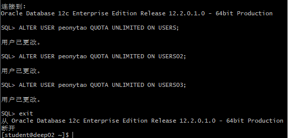
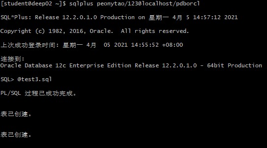
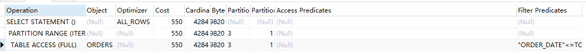
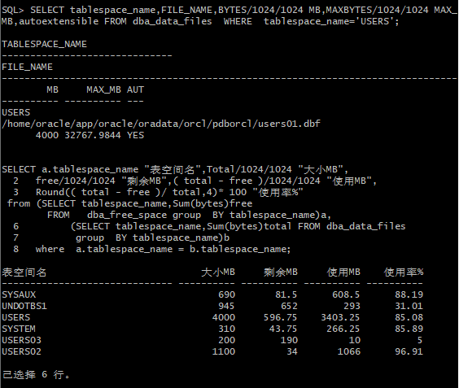

# 实验3：创建分区表

## 实验目的

掌握分区表的创建方法，掌握各种分区方式的使用场景。

## 实验内容

- 本实验使用3个表空间：USERS,USERS02,USERS03。在表空间中创建两张表：订单表(orders)与订单详表(order_details)。
- 使用peonytao账户，表创建在上述3个分区，自定义分区策略。
- 你需要使用system用户给你自己的账号分配上述分区的使用权限。你需要使用system用户给你的用户分配可以查询执行计划的权限。
- 表创建成功后，插入数据，数据能并平均分布到各个分区。每个表的数据都应该大于1万行，对表进行联合查询。
- 写出插入数据的语句和查询数据的语句，并分析语句的执行计划。
- 进行分区与不分区的对比实验。

## 实验步骤

1、使用system用户给peonytao账号分配使用权限

2、使用peonytao账户创建两张表：订单表(orders)与订单详表(order_details)。

3、表创建成功后，插入数据

4、分析查询语句的执行计划

5、查看表空间的数据库文件，以及每个文件的磁盘占用情况

