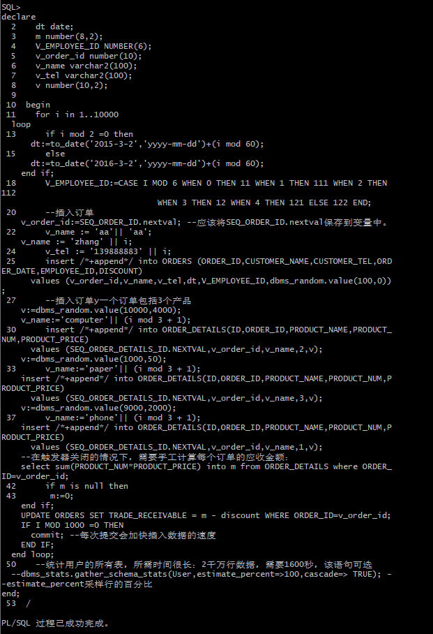
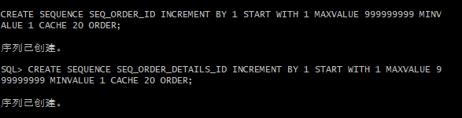
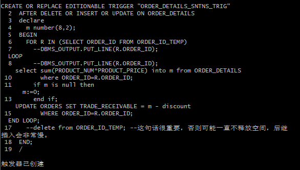
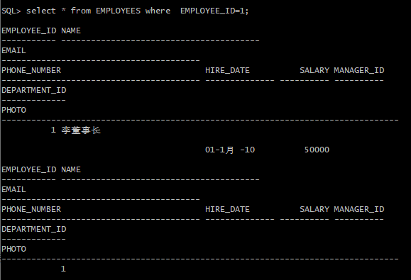
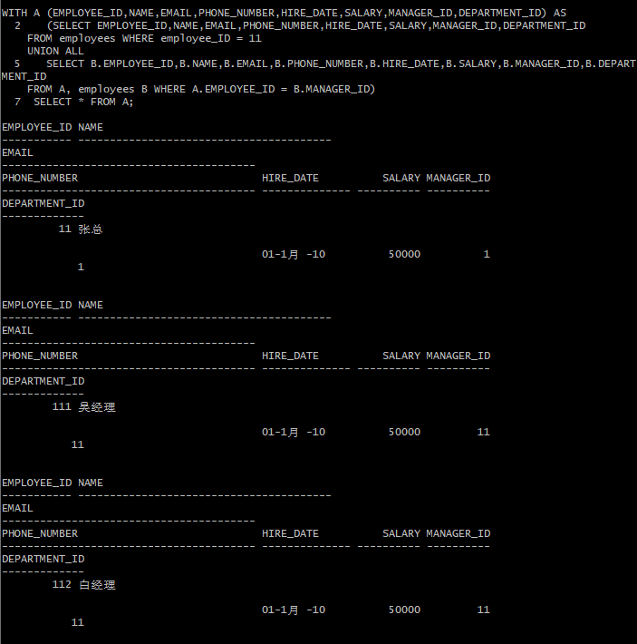
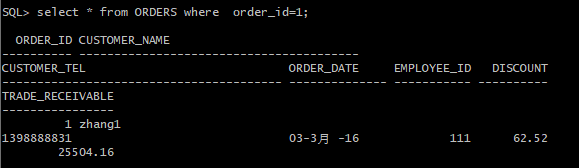
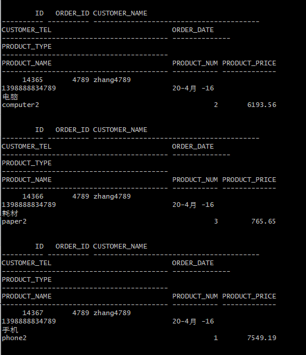
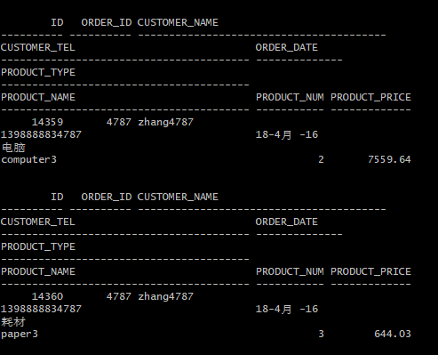
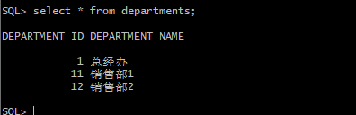

# 实验4：对象管理

## 实验目的：

了解Oracle表和视图的概念，学习使用SQL语句Create Table创建表，学习Select语句插入，修改，删除以及查询数据，学习使用SQL语句创建视图，学习部分存储过程和触发器的使用。

## 实验场景：

假设有一个生产某个产品的单位，单位接受网上订单进行产品的销售。通过实验模拟这个单位的部分信息：员工表，部门表，订单表，订单详单表。

## 用户名：

peonytao

## 实验内容：

#### 1、录入数据

#### 2、序列的应用

#### 3、触发器的应用

#### 4、查询数据

##### 4.1查询某个员工的信息

##### 4.2递归查询某个员工及其所有下属，子下属员工

##### 4.3查询订单表，并且包括订单的订单应收货款: Trade_Receivable= sum(订单详单表.ProductNum*订单详单表.ProductPrice)- Discount

##### 4.4查询订单详表，要求显示订单的客户名称和客户电话，产品类型用汉字描述

##### 4.5查询出所有空订单，即没有订单详单的订单

##### 4.6查询部门表，同时显示部门的负责人姓名

